2021-01-21\_VertNet\_Bergmann
================
Mallory A. Ballinger
1/21/2021

#### Are there any general patterns of Bergmann's Rule and Allen's Rule in American house mice?

Using metadata of *Mus musculus* downloaded from [VertNet](http://vertnet.org/), we asked if there is any evidence of Bergmann's Rule and Allen's Rule in introduced populations of American house mice.

The dataset was download from VertNet on 2020-10-13 with the following queries: \* vntype:specimen \* genus:Mus

Query records: 62139. Raw data file is located: **/data/raw/VertNet\_Mus\_specimen\_20201013.tsv**

Given the "messy" nature of VertNet data, the first-pass filters were done in the .tsv file itself, outside of R. The following filters were implemented: \* deleted fossil and occurence 'basis of record' (only kept Preserved Specimens) \* deleted the following 'continents': ND, Africa, Asia, Zoo \* deleted all island groups \* deleted all Panama entries that were collected under the 'Panama Hantavirus' expedition \* deleted any entries that had no data \* deleted all entries without latitude or longitude data \* deleted all entries that were 'founders of colonies', as these animals were apart of a lab colony \* deleted all entries described as 'road kill' or 'dead in trap' or 'found dead', as these can skew body mass \* did not include entries that had multiple entries listed for one \* deleted tail lengths that were described as broken or damaged

Next, not all data entries were coded for lifestage (e.g. adult, subadult). Only a handful were, with the large majority being left blank. During formating, I went through and coded lifestage for as many data entries as possible through the following criteria: \* *Females*: if the following reproductive data were provided, I coded the data entry as 'adult'. If not, I left it uncoded. \* presence of placental scars, \* characterized as parous, \* evidence of lactating, \* pregnant \* *Males*: if the following reproductive data were provided, I coded the data entry as 'adult'. If not, I left in uncoded. \* scrotal, \* measurements for seminal vesicles, \* characterized as TD ("testes descended"), \* characterized as TS ("testes scrotal")

The processed data file is located: **/data/processed/VertNet\_Mus\_specimen\_20201013\_processed.csv**

1.  Read in raw data, conduct additional filtering and formating

``` r
# Read in data
VertNetMetaData <- read_csv(here("data/processed/VertNet_Mus_processed.csv"),
                            col_types = cols(.default = col_character(),
                                             totallength_mm = col_double(),
                                             taillength_mm = col_double(),
                                             hindfootlength_mm = col_double(),
                                             earlength_mm = col_double(),
                                             bodyweight_g = col_double(),
                                             bodylength_mm = col_double(),
                                             year = col_double(),
                                             decimallatitude = col_double(),
                                             decimallongitude = col_double(),
                                             lengthinmm = col_double(),
                                             lengthunitsinferred = col_double(),
                                             massing = col_double(),
                                             massunitsinferred = col_double())) %>% # I first used guess_max = Inf to figure out what the column specifications are
  select(references, dynamicproperties, totallength_mm, taillength_mm, hindfootlength_mm, 
         earlength_mm, bodyweight_g, bodylength_mm, sex, lifestage, reproductivecondition,
         continent, country, stateprovince, decimallatitude, decimallongitude) %>%
  filter(continent == "North America" | continent == "South America") %>%
  filter(is.na(lifestage) | lifestage != "subadult") %>% # everything but subadult (including NAs)
  filter(is.na(lifestage) | lifestage != "undetermined") %>% # everything but undetermined (including NAs)
  filter(is.na(reproductivecondition) | reproductivecondition != "preg") %>% # everything but pregnant mice (including NAs)
  filter(sex == "female" | sex == "male") %>% # only males and females
  mutate(abslat = abs(decimallatitude),sex = as.factor(sex), lifestage = as.factor(lifestage)) %>%
  mutate_if(is.factor, fct_explicit_na, na_level = 'NA') %>% # let's you relevel NAs (I think)
  mutate(lifestage = fct_relevel(lifestage, "NA", "adult"))
```

------------------------------------------------------------------------

### 2. Explore the data - Bergmann's Rule (i.e. body weight)

##### 2a. Plot raw data (residuals) to ensure normally distributed

``` r
## Ensure data are normally distributed
hist(VertNetMetaData$bodyweight_g, breaks = 25)
```

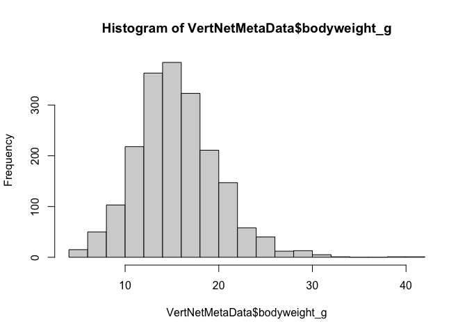

``` r
plot(VertNetMetaData$bodyweight_g)
```

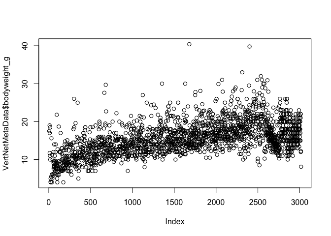

``` r
lmBW <- lm(bodyweight_g~abslat, data=VertNetMetaData)
summary(lmBW)
```

    ## 
    ## Call:
    ## lm(formula = bodyweight_g ~ abslat, data = VertNetMetaData)
    ## 
    ## Residuals:
    ##      Min       1Q   Median       3Q      Max 
    ## -12.5174  -2.7617  -0.3753   2.4829  24.7461 
    ## 
    ## Coefficients:
    ##              Estimate Std. Error t value Pr(>|t|)    
    ## (Intercept) 14.637512   0.335045  43.688  < 2e-16 ***
    ## abslat       0.030955   0.009014   3.434 0.000607 ***
    ## ---
    ## Signif. codes:  0 '***' 0.001 '**' 0.01 '*' 0.05 '.' 0.1 ' ' 1
    ## 
    ## Residual standard error: 4.398 on 1943 degrees of freedom
    ##   (1071 observations deleted due to missingness)
    ## Multiple R-squared:  0.006033,   Adjusted R-squared:  0.005521 
    ## F-statistic: 11.79 on 1 and 1943 DF,  p-value: 0.0006072

``` r
plot(lmBW$residuals)
```

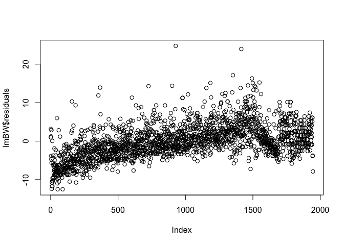

``` r
hist(lmBW$residuals, breaks = 25)
```

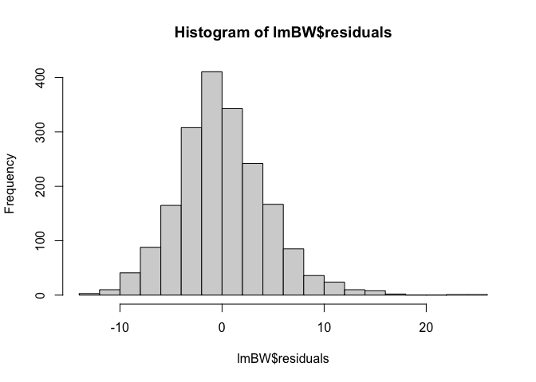 Data look normally distributed!

##### 2b. Plot residuals to identify outliers

``` r
plot(lmBW)
```

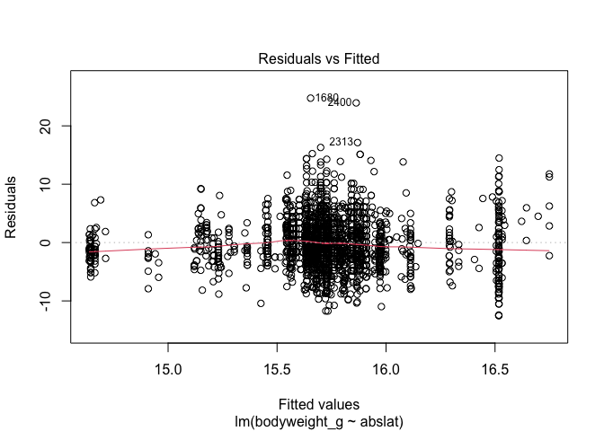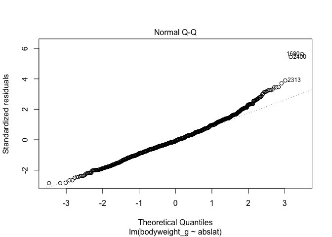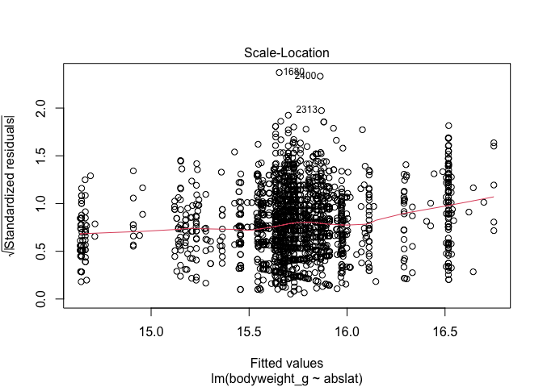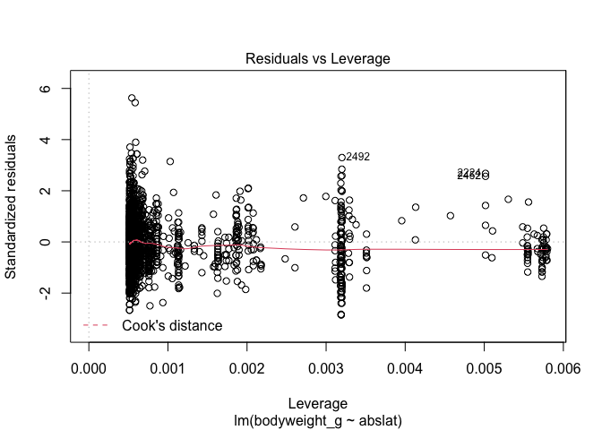

``` r
temp<-as.data.frame(VertNetMetaData)
row.names(temp)<-temp$references
lmBW2 <- lm(bodyweight_g~abslat, data=temp)
plot(lmBW2) # outliers are labeled with "$references" id
```

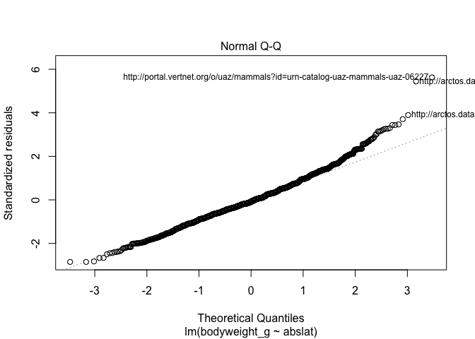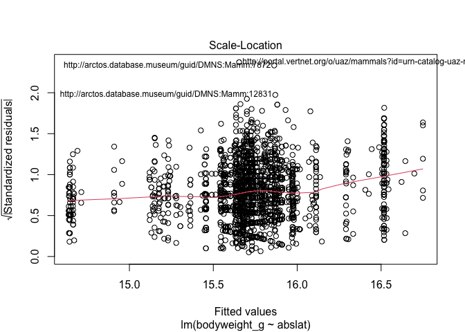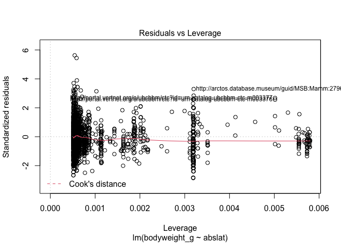 From the outlier analysis, it is clear that mice with body weights &gt; 38g are outliers. To be safe, we'll say anything over 35g since the next largest mouse in 33g. These data points will be removed from subsequent analyses. It is not as clear which smaller body weights are outliers; therefore, we'll keep all of those in both datasets.

##### 2c. Plot all the data

    ##       [,1]
    ## red      0
    ## green    0
    ## blue     0

``` r
VertNetBerg <- VertNetMetaData %>%
  filter(bodyweight_g < 35) # remove outliers

# Plot the data
Berg <-
  ggplot(data=VertNetBerg, aes(x = abslat, y = bodyweight_g)) +
  geom_jitter(aes(color = lifestage), height = 0, width = .2) +
  geom_smooth(data=subset(VertNetBerg, lifestage == "adult"),
             aes(x = abslat, y = bodyweight_g, color=factor(lifestage), fill=factor(lifestage)),
             method = "lm", se = TRUE, alpha = 0.3) + # just draws a line for adults
  scale_color_manual(values=c(fulldatacol, "black")) +
  scale_fill_manual(values=c(fulldatacol, "black")) +
  theme_bw() + 
  theme(panel.border = element_rect(color = "black", fill = NA, size = 1),
        panel.grid.major = element_blank(), panel.grid.minor = element_blank(), axis.line = element_line(colour = "black"),
        axis.title.x = element_text(margin = margin(t = 25), size = 18, face = "bold", family = "Palatino"),
        axis.title.y = element_text(margin = margin(r = 25), size = 18, face = "bold", family = "Palatino"),
        axis.text.x = element_text(size = 15, face = "bold", color = "black", family = "Palatino"),
        axis.text.y = element_text(size = 15, face = "bold", color = "black", family = "Palatino")) +
  theme(legend.title = element_blank(),
        legend.position="none",
        legend.key.size = unit(1.5, "cm"),
        legend.text = element_text(size=10),
        legend.key = element_rect(fill = "transparent")) +
  theme(plot.title = element_text(size = 14, face = "bold", hjust = 0.5, family = "Palatino")) +
  labs(x = "Absolute Latitude", y = "Body Mass (g)") +
  ggtitle("Bergmann's Rule in American house mice - includes both sexes")
Berg + geom_smooth(method = "lm", se = TRUE, color = fulldatacol, fill=fulldatacol, alpha=0.1) # draws a line for all lifestage data (both NA and adults)
```

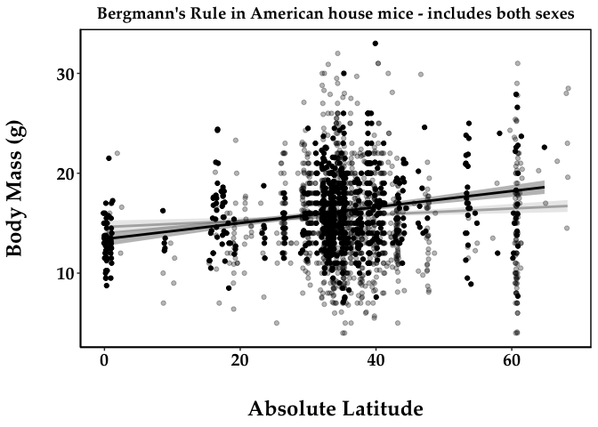

##### 2d. Plot sex-specific Bergmann's Rule

``` r
# Plot sex-specific Bergmann's rule for full dataset
VertNetBerg <- VertNetMetaData %>%
  filter(bodyweight_g < 35) # remove outliers

Berg_Sex <-
  ggplot(data=VertNetBerg, aes(x = abslat, y = bodyweight_g), color = sex) +
  geom_jitter(aes(color = sex), size = 2, height = 0, width = 0.2, alpha = 0.5) +
  geom_smooth(method = "lm", se = TRUE, aes(color = sex, fill = sex), alpha = 0.2) +
  scale_color_manual(values=c("red", "blue")) +
  scale_fill_manual(values=c("red", "blue")) +
  theme_bw() + 
 theme(panel.border = element_rect(color = "black", fill = NA, size = 1),
        panel.grid.major = element_blank(), panel.grid.minor = element_blank(), #axis.line = element_line(colour = "black"),
        axis.title.x = element_text(margin = margin(t = 25), size = 18, face = "bold", family = "Palatino"),
        axis.title.y = element_text(margin = margin(r = 25), size = 18, face = "bold", family = "Palatino"),
        axis.text.x = element_text(size = 15, face = "bold", color = "black", family = "Palatino"),
        axis.text.y = element_text(size = 15, face = "bold", color = "black", family = "Palatino")) +
  theme(legend.title = element_blank(),
        legend.position = c(0.1, 0.95), legend.box = "horizontal",
        legend.key.size = unit(0.5, "cm"),
        legend.text = element_text(size=10, family = "Palatino"),
        legend.key = element_rect(fill = "transparent")) +
  theme(plot.title = element_text(size = 14, face = "bold", hjust = 0.5, family = "Palatino")) +
  labs(x = "Absolute Latitude", y = "Body Mass (g)") +
  ggtitle("Sex-specific Bergmann's Rule for entire dataset")
Berg_Sex
```

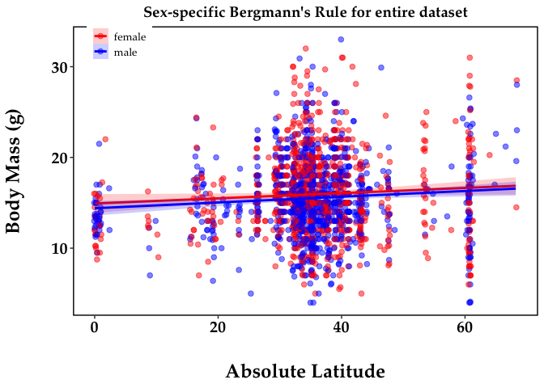

``` r
# Plot sex-specific Bergmann's rule for adult-only dataset
VertNetBergAdults <- VertNetMetaData %>%
  filter(bodyweight_g < 35) %>%
  filter(lifestage == "adult")

Berg_Sex_Adults <-
  ggplot(data=VertNetBergAdults, aes(x = abslat, y = bodyweight_g), color = sex) +
  geom_jitter(aes(color = sex), size = 2, height = 0, width = 0.2, alpha = 0.5) +
  geom_smooth(method = "lm", se = TRUE, aes(color=sex, fill=sex), alpha = 0.2) + # se default (TRUE) shows 95% CI
  scale_color_manual(values=c("red", "blue")) +
  scale_fill_manual(values=c("red", "blue")) +
  theme_bw() + 
  theme(panel.border = element_rect(color = "black", fill = NA, size = 1),
        panel.grid.major = element_blank(), panel.grid.minor = element_blank(), #axis.line = element_line(colour = "black"),
        axis.title.x = element_text(margin = margin(t = 25), size = 18, face = "bold", family = "Palatino"),
        axis.title.y = element_text(margin = margin(r = 25), size = 18, face = "bold", family = "Palatino"),
        axis.text.x = element_text(size = 15, face = "bold", color = "black", family = "Palatino"),
        axis.text.y = element_text(size = 15, face = "bold", color = "black", family = "Palatino")) +
  theme(legend.title = element_blank(),
        legend.position = c(0.1, 0.95), legend.box = "horizontal",
        legend.key.size = unit(0.5, "cm"),
        legend.text = element_text(size=10, family = "Palatino"),
        legend.key = element_rect(fill = "transparent")) +
  theme(plot.title = element_text(size = 14, face = "bold", hjust = 0.5, family = "Palatino")) +
  labs(x = "Absolute Latitude", y = "Body Mass (g)") +
  ggtitle("Sex-specific Bergmann's Rule for adults-only dataset")
Berg_Sex_Adults
```

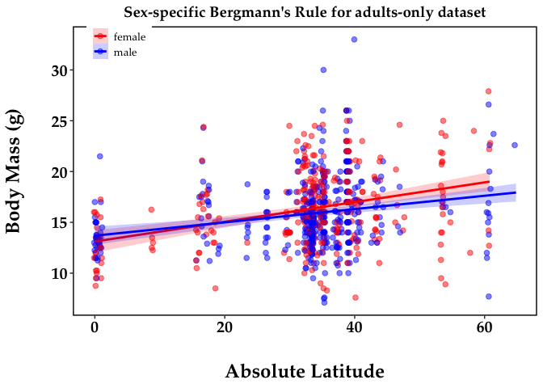

##### 2e. Stats for Bergmann's Rule

``` r
# Model 1 includes all data, no sex
BergM1 <- lm(bodyweight_g~abslat, data = VertNetBerg)

# Model 2 includes adult-only data, no sex
BergM2 <- lm(bodyweight_g~abslat, data = VertNetBergAdults)

# Model 3 includes all data, with both sexes
BergM3 <- lm(bodyweight_g~abslat*sex, data = VertNetBerg)

# Model 4 includes all data, with only females
VertNetBergF <- VertNetBerg %>%
  filter(sex == "female")
BergM4 <- lm(bodyweight_g~abslat, data = VertNetBergF)

# Model 5 includes all data, with only males
VertNetBergM <- VertNetBerg %>%
  filter(sex == "male")
BergM5 <- lm(bodyweight_g~abslat, data = VertNetBergM)

# Model 6 includes adult-only data, with both sexes
BergM6 <- lm(bodyweight_g~abslat*sex, data = VertNetBergAdults)

# Model 7 includes adult-only data, with only females
VertNetBergAdultsF <- VertNetBergAdults %>%
  filter(sex == "female")
BergM7 <- lm(bodyweight_g~abslat, data = VertNetBergAdultsF)

# Model 8 includes adult-only data, with only males
VertNetBergAdultsM <- VertNetBergAdults %>%
  filter(sex == "male")
BergM8 <- lm(bodyweight_g~abslat, data = VertNetBergAdultsM)


stargazer(BergM1, BergM2,
          title = "Body weight regression table - all data vs. adult-only data",
          label = "tab1",
          table.placement = "H",
          column.labels = c("M1", "M2"),
          model.numbers = FALSE,
          header = FALSE)
```

    ## 
    ## \begin{table}[H] \centering 
    ##   \caption{Body weight regression table - all data vs. adult-only data} 
    ##   \label{tab1} 
    ## \begin{tabular}{@{\extracolsep{5pt}}lcc} 
    ## \\[-1.8ex]\hline 
    ## \hline \\[-1.8ex] 
    ##  & \multicolumn{2}{c}{\textit{Dependent variable:}} \\ 
    ## \cline{2-3} 
    ## \\[-1.8ex] & \multicolumn{2}{c}{bodyweight\_g} \\ 
    ##  & M1 & M2 \\ 
    ## \hline \\[-1.8ex] 
    ##  abslat & 0.031$^{***}$ & 0.080$^{***}$ \\ 
    ##   & (0.009) & (0.010) \\ 
    ##   & & \\ 
    ##  Constant & 14.617$^{***}$ & 13.409$^{***}$ \\ 
    ##   & (0.330) & (0.355) \\ 
    ##   & & \\ 
    ## \hline \\[-1.8ex] 
    ## Observations & 1,943 & 754 \\ 
    ## R$^{2}$ & 0.006 & 0.078 \\ 
    ## Adjusted R$^{2}$ & 0.006 & 0.076 \\ 
    ## Residual Std. Error & 4.330 (df = 1941) & 3.439 (df = 752) \\ 
    ## F Statistic & 12.055$^{***}$ (df = 1; 1941) & 63.302$^{***}$ (df = 1; 752) \\ 
    ## \hline 
    ## \hline \\[-1.8ex] 
    ## \textit{Note:}  & \multicolumn{2}{r}{$^{*}$p$<$0.1; $^{**}$p$<$0.05; $^{***}$p$<$0.01} \\ 
    ## \end{tabular} 
    ## \end{table}

``` r
stargazer(BergM3, BergM6,
          title = "Body weight regression table - all data vs. adult-only data, with sex",
          label = "tab2",
          table.placement = "H",
          column.labels = c("M3", "M6"),
          model.numbers = FALSE,
          header = FALSE)
```

    ## 
    ## \begin{table}[H] \centering 
    ##   \caption{Body weight regression table - all data vs. adult-only data, with sex} 
    ##   \label{tab2} 
    ## \begin{tabular}{@{\extracolsep{5pt}}lcc} 
    ## \\[-1.8ex]\hline 
    ## \hline \\[-1.8ex] 
    ##  & \multicolumn{2}{c}{\textit{Dependent variable:}} \\ 
    ## \cline{2-3} 
    ## \\[-1.8ex] & \multicolumn{2}{c}{bodyweight\_g} \\ 
    ##  & M3 & M6 \\ 
    ## \hline \\[-1.8ex] 
    ##  abslat & 0.029$^{**}$ & 0.097$^{***}$ \\ 
    ##   & (0.013) & (0.015) \\ 
    ##   & & \\ 
    ##  sexmale & $-$0.526 & 0.575 \\ 
    ##   & (0.664) & (0.713) \\ 
    ##   & & \\ 
    ##  abslat:sexmale & 0.003 & $-$0.032 \\ 
    ##   & (0.018) & (0.020) \\ 
    ##   & & \\ 
    ##  Constant & 14.925$^{***}$ & 13.115$^{***}$ \\ 
    ##   & (0.494) & (0.532) \\ 
    ##   & & \\ 
    ## \hline \\[-1.8ex] 
    ## Observations & 1,943 & 754 \\ 
    ## R$^{2}$ & 0.008 & 0.085 \\ 
    ## Adjusted R$^{2}$ & 0.007 & 0.081 \\ 
    ## Residual Std. Error & 4.328 (df = 1939) & 3.431 (df = 750) \\ 
    ## F Statistic & 5.499$^{***}$ (df = 3; 1939) & 23.162$^{***}$ (df = 3; 750) \\ 
    ## \hline 
    ## \hline \\[-1.8ex] 
    ## \textit{Note:}  & \multicolumn{2}{r}{$^{*}$p$<$0.1; $^{**}$p$<$0.05; $^{***}$p$<$0.01} \\ 
    ## \end{tabular} 
    ## \end{table}

``` r
stargazer(BergM4, BergM5, BergM7, BergM8,
          title = "Body weight regression table - all data vs. adult-only data, with sexes separated out",
          label = "tab3",
          table.placement = "H",
          column.labels = c("M4", "M5", "M7", "M8"),
          model.numbers = FALSE,
          header = FALSE)
```

    ## 
    ## \begin{table}[H] \centering 
    ##   \caption{Body weight regression table - all data vs. adult-only data, with sexes separated out} 
    ##   \label{tab3} 
    ## \begin{tabular}{@{\extracolsep{5pt}}lcccc} 
    ## \\[-1.8ex]\hline 
    ## \hline \\[-1.8ex] 
    ##  & \multicolumn{4}{c}{\textit{Dependent variable:}} \\ 
    ## \cline{2-5} 
    ## \\[-1.8ex] & \multicolumn{4}{c}{bodyweight\_g} \\ 
    ##  & M4 & M5 & M7 & M8 \\ 
    ## \hline \\[-1.8ex] 
    ##  abslat & 0.029$^{**}$ & 0.032$^{***}$ & 0.097$^{***}$ & 0.065$^{***}$ \\ 
    ##   & (0.014) & (0.011) & (0.016) & (0.013) \\ 
    ##   & & & & \\ 
    ##  Constant & 14.925$^{***}$ & 14.399$^{***}$ & 13.115$^{***}$ & 13.690$^{***}$ \\ 
    ##   & (0.529) & (0.415) & (0.556) & (0.458) \\ 
    ##   & & & & \\ 
    ## \hline \\[-1.8ex] 
    ## Observations & 880 & 1,063 & 323 & 431 \\ 
    ## R$^{2}$ & 0.005 & 0.007 & 0.108 & 0.055 \\ 
    ## Adjusted R$^{2}$ & 0.004 & 0.006 & 0.105 & 0.053 \\ 
    ## Residual Std. Error & 4.634 (df = 878) & 4.057 (df = 1061) & 3.584 (df = 321) & 3.311 (df = 429) \\ 
    ## F Statistic & 4.095$^{**}$ (df = 1; 878) & 7.929$^{***}$ (df = 1; 1061) & 38.676$^{***}$ (df = 1; 321) & 24.878$^{***}$ (df = 1; 429) \\ 
    ## \hline 
    ## \hline \\[-1.8ex] 
    ## \textit{Note:}  & \multicolumn{4}{r}{$^{*}$p$<$0.1; $^{**}$p$<$0.05; $^{***}$p$<$0.01} \\ 
    ## \end{tabular} 
    ## \end{table}

And here are the tables to see?: Table 1 tab1, Table 2 tab2, and Table 3 tab3.
