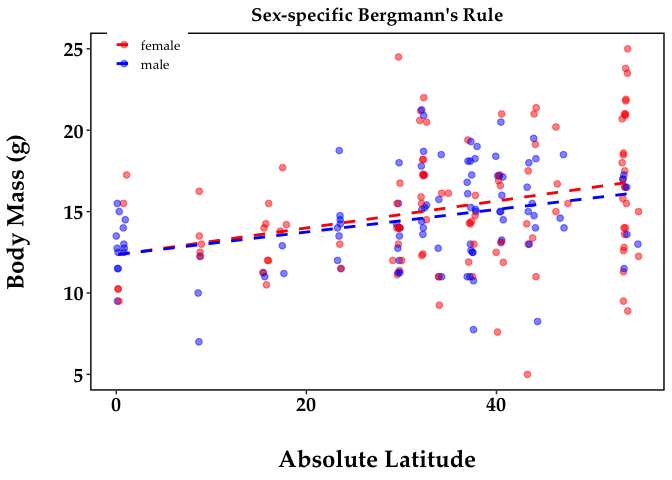
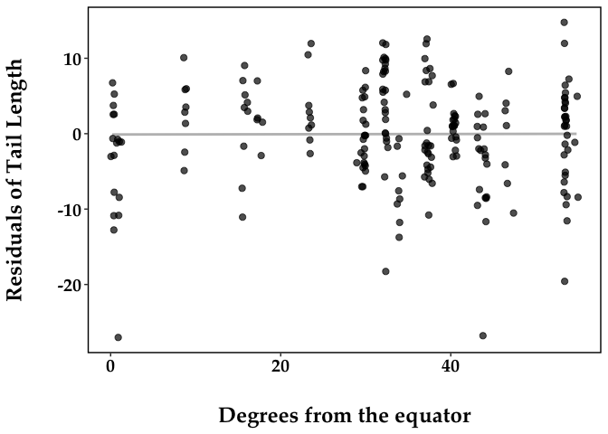

Bergmann’s Rule and Allen’s Rule in Nachman Lab latitudinal transects
================
Mallory A. Ballinger
2/15/2021

### Overview

Determine if house mice show Bergmann’s rule and Allen’s rule using
specimens collected by the Nachman Lab. House mice have been collected
across a broad latitudinal distribution in the Americas, as part of a
large lab project - [“Environmental adaptation in introduced populations
of house mice, Mus musculus, across the
Americas”](http://arctos.database.museum/project/10001341).

### Bergmann’s rule (using body weight)

    ## 
    ## Call:
    ## lm(formula = WEIGHT ~ ABS_LAT, data = NachmanTransectsMetadata)
    ## 
    ## Residuals:
    ##      Min       1Q   Median       3Q      Max 
    ## -10.6916  -2.3280  -0.2465   2.0113   9.8655 
    ## 
    ## Coefficients:
    ##             Estimate Std. Error t value Pr(>|t|)    
    ## (Intercept) 12.28659    0.53893  22.798  < 2e-16 ***
    ## ABS_LAT      0.07859    0.01474   5.332 2.48e-07 ***
    ## ---
    ## Signif. codes:  0 '***' 0.001 '**' 0.01 '*' 0.05 '.' 0.1 ' ' 1
    ## 
    ## Residual standard error: 3.238 on 212 degrees of freedom
    ##   (1 observation deleted due to missingness)
    ## Multiple R-squared:  0.1182, Adjusted R-squared:  0.1141 
    ## F-statistic: 28.43 on 1 and 212 DF,  p-value: 2.482e-07

    ## [1] 25.0 24.5  5.0

    ## Warning in cor.test.default(x = NachmanTransectsMetadata$ABS_LAT, y =
    ## NachmanTransectsMetadata$WEIGHT, : Cannot compute exact p-value with ties

    ## 
    ##  Spearman's rank correlation rho
    ## 
    ## data:  NachmanTransectsMetadata$ABS_LAT and NachmanTransectsMetadata$WEIGHT
    ## S = 1077240, p-value = 3.31e-07
    ## alternative hypothesis: true rho is not equal to 0
    ## sample estimates:
    ##       rho 
    ## 0.3404738

##### Plot Bergmann’s rule: body weight X absolute latitude

``` r
Berg<-
  ggplot(data=NachmanTransectsMetadata, aes(x = ABS_LAT, y = WEIGHT)) +
  geom_smooth(color = "gray", fill = "gray", linetype = "solid", method = "lm", se = FALSE) + # se default (TRUE) shows 95% CI
  geom_jitter(size = 2.2, height = 0, width = 0.2, alpha = 0.7) +
  theme_bw() + 
  theme(panel.border = element_rect(color = "black", fill = NA, size = 1),
        panel.grid.major = element_blank(), panel.grid.minor = element_blank(), #axis.line = element_line(colour = "black"),
        axis.title.x = element_text(margin = margin(t = 25), size = 18, face = "bold", family = "Palatino"),
        axis.title.y = element_text(margin = margin(r = 25), size = 18, face = "bold", family = "Palatino"),
        axis.text.x = element_text(size = 15, face = "bold", color = "black", family = "Palatino"),
        axis.text.y = element_text(size = 15, face = "bold", color = "black", family = "Palatino")) +
  theme(legend.title = element_blank(),
        legend.position = c(0.1, 0.95), legend.box = "horizontal",
        legend.key.size = unit(0.5, "cm"),
        legend.text = element_text(size=10, family = "Palatino"),
        legend.key = element_rect(fill = "transparent")) +
  theme(plot.title = element_text(size = 14, face = "bold", hjust = 0.5, family = "Palatino")) +
  labs(x = "Degrees from the equator", y = "Body Mass (g)")
Berg
```

    ## Warning: Removed 1 rows containing non-finite values (stat_smooth).

    ## Warning: Removed 1 rows containing missing values (geom_point).

<!-- -->

``` r
# Plot sex-specific Bergmann's rule

Berg_Sex <-
  ggplot(data=NachmanTransectsMetadata, aes(x = ABS_LAT, y = WEIGHT), color = SEX) +
  geom_jitter(aes(color = SEX), size = 2, height = 0, width = 0.2, alpha = 0.5) +
  geom_smooth(method = "lm", se = FALSE, aes(color=SEX, fill=SEX), alpha = 0.2, linetype = "dashed") + # se default (TRUE) shows 95% CI
  scale_color_manual(values=c("red", "blue")) +
  scale_fill_manual(values=c("red", "blue")) +
  theme_bw() + 
  theme(panel.border = element_rect(color = "black", fill = NA, size = 1),
        panel.grid.major = element_blank(), panel.grid.minor = element_blank(), #axis.line = element_line(colour = "black"),
        axis.title.x = element_text(margin = margin(t = 25), size = 18, face = "bold", family = "Palatino"),
        axis.title.y = element_text(margin = margin(r = 25), size = 18, face = "bold", family = "Palatino"),
        axis.text.x = element_text(size = 15, face = "bold", color = "black", family = "Palatino"),
        axis.text.y = element_text(size = 15, face = "bold", color = "black", family = "Palatino")) +
  theme(legend.title = element_blank(),
        legend.position = c(0.1, 0.95), legend.box = "horizontal",
        legend.key.size = unit(0.5, "cm"),
        legend.text = element_text(size=10, family = "Palatino"),
        legend.key = element_rect(fill = "transparent")) +
  theme(plot.title = element_text(size = 14, face = "bold", hjust = 0.5, family = "Palatino")) +
  labs(x = "Absolute Latitude", y = "Body Mass (g)") +
  ggtitle("Sex-specific Bergmann's Rule")
Berg_Sex
```

    ## Warning: Removed 1 rows containing non-finite values (stat_smooth).

    ## Warning: Removed 1 rows containing missing values (geom_point).

<!-- -->

There is strong and clear evidence for Bergmann’s rule in wild-caught
“Nachman Lab” house mice across the Americas

### Allen’s rule (using tail length)

    ## 
    ## Call:
    ## lm(formula = TAIL_LENGTH ~ WEIGHT, data = Nachman_TailData)
    ## 
    ## Residuals:
    ##      Min       1Q   Median       3Q      Max 
    ## -27.0240  -3.3907   0.5847   4.1876  14.7635 
    ## 
    ## Coefficients:
    ##             Estimate Std. Error t value Pr(>|t|)    
    ## (Intercept)  63.5533     2.0404  31.148   <2e-16 ***
    ## WEIGHT        1.1917     0.1329   8.964   <2e-16 ***
    ## ---
    ## Signif. codes:  0 '***' 0.001 '**' 0.01 '*' 0.05 '.' 0.1 ' ' 1
    ## 
    ## Residual standard error: 6.684 on 210 degrees of freedom
    ## Multiple R-squared:  0.2768, Adjusted R-squared:  0.2733 
    ## F-statistic: 80.36 on 1 and 210 DF,  p-value: < 2.2e-16

##### Plot Allen’s rule: Tail length residuals X absolute latitude

``` r
Tail_Allen <-
  ggplot(data=Nachman_TailData, aes(x = ABS_LAT, y = Resids_TLBW)) +
  geom_smooth(color = "gray", fill = "gray", linetype = "solid", method = "lm", se = FALSE) + # se default (TRUE) shows 95% CI
  geom_jitter(size = 2.2, height = 0, width = 0.2, alpha = 0.7) +
  theme_bw() + 
  theme(panel.border = element_rect(color = "black", fill = NA, size = 1),
        panel.grid.major = element_blank(), panel.grid.minor = element_blank(), #axis.line = element_line(colour = "black"),
        axis.title.x = element_text(margin = margin(t = 25), size = 18, face = "bold", family = "Palatino"),
        axis.title.y = element_text(margin = margin(r = 25), size = 18, face = "bold", family = "Palatino"),
        axis.text.x = element_text(size = 15, face = "bold", color = "black", family = "Palatino"),
        axis.text.y = element_text(size = 15, face = "bold", color = "black", family = "Palatino")) +
  theme(legend.title = element_blank(),
        legend.position = c(0.1, 0.95), legend.box = "horizontal",
        legend.key.size = unit(0.5, "cm"),
        legend.text = element_text(size=10, family = "Palatino"),
        legend.key = element_rect(fill = "transparent")) +
  theme(plot.title = element_text(size = 14, face = "bold", hjust = 0.5, family = "Palatino")) +
  labs(x = "Degrees from the equator", y = "Residuals of Tail Length")
Tail_Allen
```

    ## Warning: Removed 1 rows containing non-finite values (stat_smooth).

    ## Warning: Removed 1 rows containing missing values (geom_point).

<!-- -->

Unlike Bergmann’s rule, there is no clear evidence for Allen’s rule
(i.e. tail length) in wild-caught “Nachman Lab” house mice across the
Americas

### Some stats

``` r
## Bergmann
corrBW <- cor.test(x = NachmanTransectsMetadata$ABS_LAT, y = NachmanTransectsMetadata$WEIGHT, method = 'spearman') # correlation
```

    ## Warning in cor.test.default(x = NachmanTransectsMetadata$ABS_LAT, y =
    ## NachmanTransectsMetadata$WEIGHT, : Cannot compute exact p-value with ties

``` r
corrBW
```

    ## 
    ##  Spearman's rank correlation rho
    ## 
    ## data:  NachmanTransectsMetadata$ABS_LAT and NachmanTransectsMetadata$WEIGHT
    ## S = 1077240, p-value = 3.31e-07
    ## alternative hypothesis: true rho is not equal to 0
    ## sample estimates:
    ##       rho 
    ## 0.3404738

``` r
lmBW <- lm(WEIGHT~ABS_LAT, data=NachmanTransectsMetadata) # linear regression
summary(lmBW)
```

    ## 
    ## Call:
    ## lm(formula = WEIGHT ~ ABS_LAT, data = NachmanTransectsMetadata)
    ## 
    ## Residuals:
    ##      Min       1Q   Median       3Q      Max 
    ## -10.6916  -2.3280  -0.2465   2.0113   9.8655 
    ## 
    ## Coefficients:
    ##             Estimate Std. Error t value Pr(>|t|)    
    ## (Intercept) 12.28659    0.53893  22.798  < 2e-16 ***
    ## ABS_LAT      0.07859    0.01474   5.332 2.48e-07 ***
    ## ---
    ## Signif. codes:  0 '***' 0.001 '**' 0.01 '*' 0.05 '.' 0.1 ' ' 1
    ## 
    ## Residual standard error: 3.238 on 212 degrees of freedom
    ##   (1 observation deleted due to missingness)
    ## Multiple R-squared:  0.1182, Adjusted R-squared:  0.1141 
    ## F-statistic: 28.43 on 1 and 212 DF,  p-value: 2.482e-07

``` r
## Allen
corrTLBW <- cor.test(x = Nachman_TailData$ABS_LAT, y = Nachman_TailData$Resids_TLBW, method = 'spearman') # correlation
```

    ## Warning in cor.test.default(x = Nachman_TailData$ABS_LAT, y =
    ## Nachman_TailData$Resids_TLBW, : Cannot compute exact p-value with ties

``` r
corrTLBW
```

    ## 
    ##  Spearman's rank correlation rho
    ## 
    ## data:  Nachman_TailData$ABS_LAT and Nachman_TailData$Resids_TLBW
    ## S = 1687656, p-value = 0.2596
    ## alternative hypothesis: true rho is not equal to 0
    ## sample estimates:
    ##         rho 
    ## -0.07794741

``` r
lm_resTLBW <- lm(Resids_TLBW~ABS_LAT, data = Nachman_TailData) # linear regression
summary(lm_resTLBW)
```

    ## 
    ## Call:
    ## lm(formula = Resids_TLBW ~ ABS_LAT, data = Nachman_TailData)
    ## 
    ## Residuals:
    ##      Min       1Q   Median       3Q      Max 
    ## -26.9196  -3.4960   0.4748   4.2267  14.7861 
    ## 
    ## Coefficients:
    ##              Estimate Std. Error t value Pr(>|t|)
    ## (Intercept) -0.105760   1.110147  -0.095    0.924
    ## ABS_LAT      0.001558   0.030326   0.051    0.959
    ## 
    ## Residual standard error: 6.654 on 209 degrees of freedom
    ##   (1 observation deleted due to missingness)
    ## Multiple R-squared:  1.263e-05,  Adjusted R-squared:  -0.004772 
    ## F-statistic: 0.00264 on 1 and 209 DF,  p-value: 0.9591
